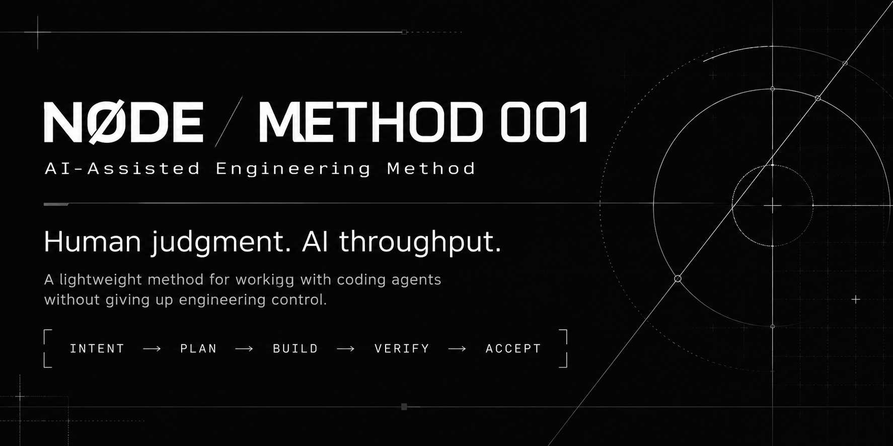

# NØDE / AI-Assisted Engineering Method

**Human judgment. AI throughput.**

<p align="center">
  
</p>

Fast implementation is useful.

Losing the ability to understand, verify or reject what gets built isn't.

This method gives coding agents room to move fast when work is clear, bounded, reversible and verifiable — while keeping human judgment on the decisions that actually matter.

---

## Install

```sh
uvx --from git+https://github.com/TheSamurai4861/ai-assisted-method.git ai-assisted-method
```

Preview changes first:

```sh
uvx --from git+https://github.com/TheSamurai4861/ai-assisted-method.git ai-assisted-method --dry-run
```

Local alternative:

```sh
python /path/to/ai-assisted-method/scripts/install.py
```

Run the command from the project adopting the method. If method files already exist, the installer shows three choices:

| Choice | Effect |
|---|---|
| **Update** | For an existing AI-Assisted method: back up and update rules, including `SECURITY.md`, while preserving the project's `PROJECT_MAP.md` and `VERIFICATION.md` |
| **Separate** | Keep all existing files and stage this method under `.ai/ai-assisted-method/` for comparison |
| **Replace** | Back up and replace all matching method files, including security rules and project-specific templates |

The installer never chooses between conflicting rule sets silently. In a non-interactive shell, add `--mode update`, `--mode separate`, or `--mode replace` to the command. Backups are stored under `.ai/ai-assisted-method-backups/`. Existing `AGENTS.md` instructions are preserved; the installer adds or updates only its own reference block.

---

## The idea

AI should increase engineering throughput without taking ownership of engineering judgment.

### Humans own

- intent
- problem definition
- product direction
- important creative choices
- architecture trade-offs
- taste and subjective quality
- risk acceptance
- difficult-to-reverse decisions
- final acceptance

### Agents accelerate

- inspection
- research
- option generation
- implementation
- repetitive engineering work
- testing
- verification
- failure analysis
- review

AI-generated code is a **candidate change**, not an established truth.

---

## Workflow

```text
INTENT
  ↓
CLASSIFY
  ↓
RISK
  ↓
UNDERSTAND
  ↓
SPEC
  ↓
PLAN
  ↓
BUILD
  ↓
VERIFY
  ↓
REVIEW
  ↓
ACCEPT
  ↓
LEARN
```

The process gets heavier only when the risk does.

Small, clear and reversible changes should stay lightweight.

Higher-risk work needs stronger acceptance criteria, deeper verification and more human review.

If an assumption breaks, go back to `PLAN` or `SPEC` instead of pushing forward.

---

## Autonomy

More AI autonomy when work is:

```text
clear · bounded · reversible · verifiable
```

More human judgment when work is:

```text
ambiguous · subjective · high-impact · hard to reverse
```

The agent may propose creative or architectural options.

It should not silently own consequential decisions.

Sensitive work still follows the project security rules in [`.ai/SECURITY.md`](.ai/SECURITY.md).

---

## Quick start

After installing the method into a project:

1. Run [`prompts/bootstrap-new-project.md`](prompts/bootstrap-new-project.md) with your coding agent.
2. Review the generated project facts in [`.ai/PROJECT_MAP.md`](.ai/PROJECT_MAP.md).
3. Configure real verification commands in [`.ai/VERIFICATION.md`](.ai/VERIFICATION.md).
4. Start work with [`prompts/start-task.md`](prompts/start-task.md) or a specialized workflow.
5. For medium/high-risk tasks, record acceptance criteria and evidence in [`.ai/TASK_TEMPLATE.md`](.ai/TASK_TEMPLATE.md).
6. Verify, review and obtain human acceptance before calling the work complete.

The generic [method](.ai/METHOD.md) applies whenever no specialized workflow is needed.

---

## Repository structure

| Path | Purpose |
|---|---|
| [`AGENTS.md`](AGENTS.md) | Short agent entrypoint and invariants |
| [`.ai/METHOD.md`](.ai/METHOD.md) | Authoritative lifecycle, autonomy and acceptance rules |
| [`.ai/PROJECT_MAP.md`](.ai/PROJECT_MAP.md) | Observed project facts |
| [`.ai/VERIFICATION.md`](.ai/VERIFICATION.md) | Verification policy and project checks |
| [`.ai/SECURITY.md`](.ai/SECURITY.md) | Sensitive actions and least-privilege rules |
| [`.ai/workflows/`](.ai/workflows/) | Specialized task guidance |
| [`prompts/`](prompts/) | Reusable task starters |
| [`examples/`](examples/) | Example task records |
| [`scripts/install.py`](scripts/install.py) | Installer |
| [`scripts/validate.py`](scripts/validate.py) | Repository validation |
| [`tests/`](tests/) | Method tooling tests |

---

## Examples

The examples are illustrative task records, not production claims.

| Example | Risk | Main lesson |
|---|---:|---|
| [Maintenance](examples/MAINTENANCE_EXAMPLE.md) | S | Keep clear, reversible work lightweight |
| [Feature](examples/FEATURE_EXAMPLE.md) | M | Human chooses product behavior; agent implements |
| [Investigation](examples/INVESTIGATION_EXAMPLE.md) | M | Separate diagnosis from correction |
| [Bugfix](examples/BUGFIX_EXAMPLE.md) | H | Verify sensitive assumptions before acceptance |
| [Migration](examples/MIGRATION_EXAMPLE.md) | H | Stage irreversible changes and require approval |

A real preparation defect found while building the installer is documented in [INSTALLER_CASE_STUDY.md](examples/INSTALLER_CASE_STUDY.md).

---

## Try it on a real project

Use the method on real work, then keep only what proves useful.

Track:

- task criteria
- human decisions
- verification evidence
- interruptions
- rework
- failures the process caught
- steps that added no value

Then use `LEARN` to improve the smallest relevant rule or executable check.

The method should evolve from observed failures, not accumulate process for its own sake.

---

## Validation

For this repository:

```sh
python scripts/validate.py
python -m unittest discover -s tests -v
```

The same checks run through GitHub Actions on Linux and Windows.

---

## What this is not

This method does not:

- guarantee correctness
- replace engineering expertise
- require a large spec for every task
- require approval for every trivial agent action
- treat green tests as complete proof
- grant autonomy where decisions cannot be safely verified

---

## Status

This is an evolving method.

It is meant to improve through real use, real failures and evidence.

It is not a universal standard.

---

## License

MIT — see [LICENSE](LICENSE).

---

<sub>NØDE — building and testing things that shouldn't exist yet.</sub>
